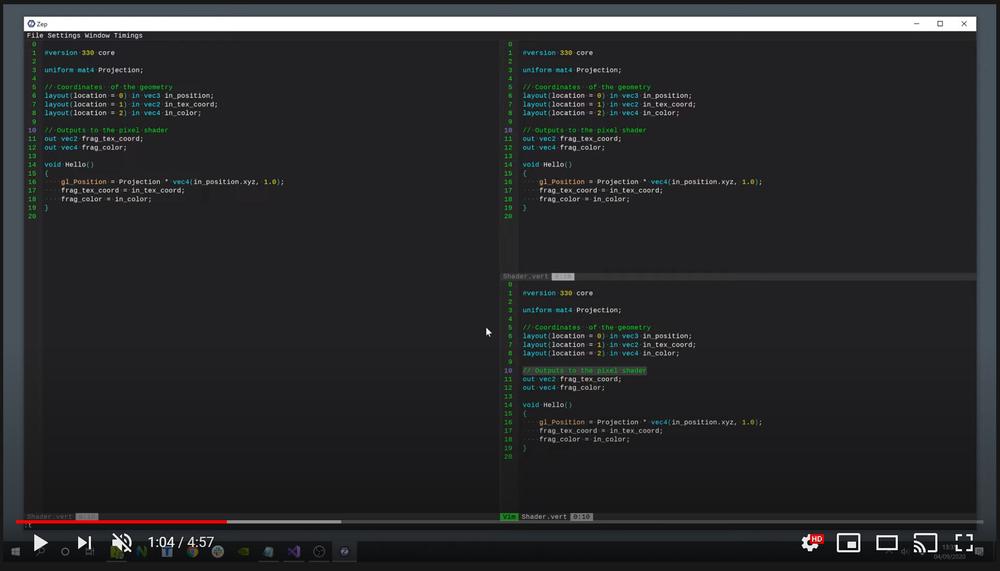
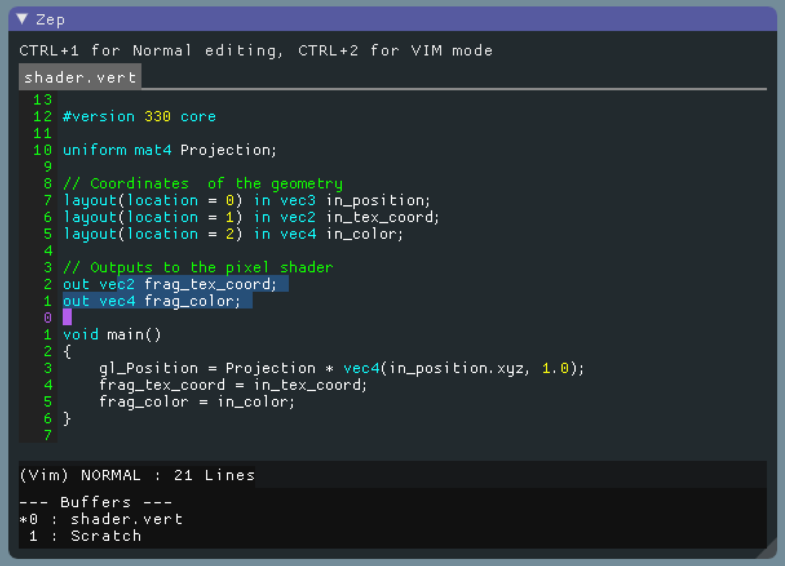
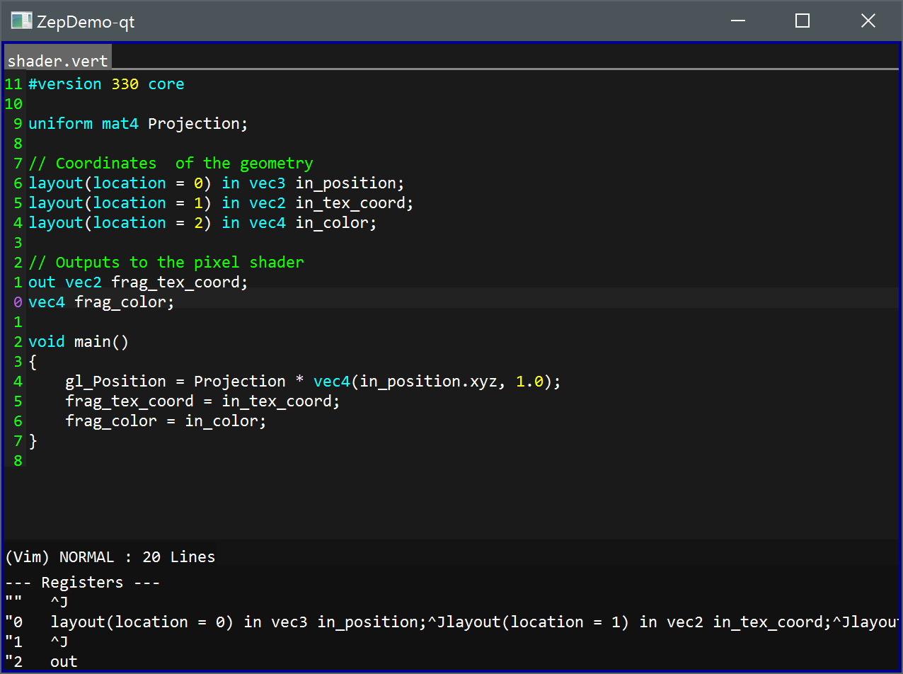
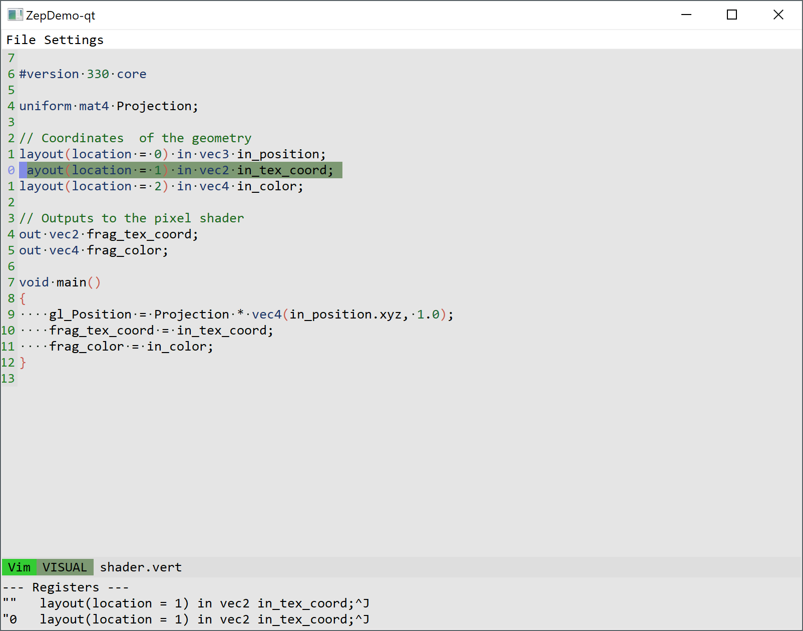
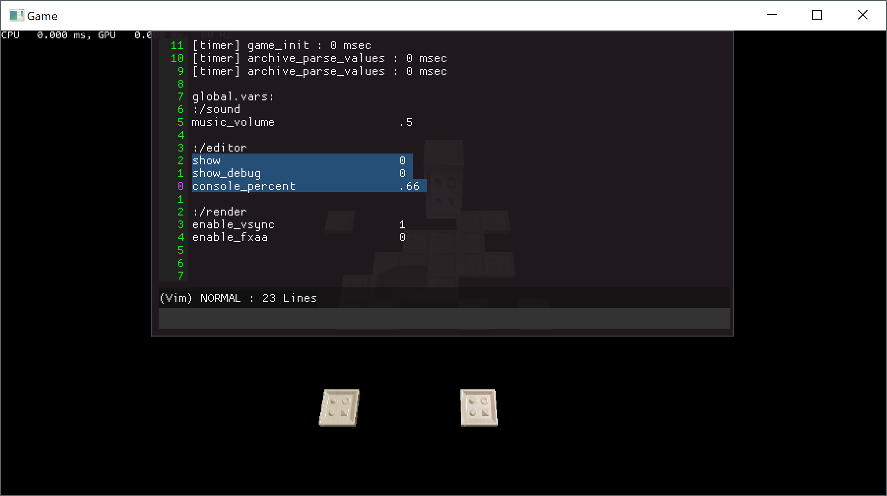

[Zep](https://github.com/Rezonality/zep) - A Mini Editor
===================================================================================================

[](https://travis-ci.org/Rezonality/zep)
[](https://ci.appveyor.com/project/cmaughan/zep)
[](https://codecov.io/gh/Rezonality/zep)
[](https://github.com/Resonality/zep/blob/master/LICENSE) 
[](https://gitter.im/Rezonality/Zep?utm_source=badge&utm_medium=badge&utm_campaign=pr-badge)

Zep is a simple embeddable editor, with a rendering agnostic design and optional Vim mode.  It is built as a shared modern-cmake library.  The core library is dependency-free (the demo application requires an installed package), and it is possible just to copy the files into your project and build it.  Out of the box Zep can draw to a Qt Widget or an an ImGui window - useful for embedding in a game engine.  A simple syntax highlighting engine is provided, and can easily be extended. Basic theming support is included, and window tabs and vertical/horizontal splits are also available.  Zep is 'opinionated' in how it does things, but is easy to modify and supports many common features.  It is heavliy influenced by Vim, but has a good notepad-style editing mode too.  A simple search feature (Ctrl+P) is a powerful way to find things, and a Repl mode is useful for implementing a console for game scripting.  Intended to eventually sit inside a live-coding environment, Zep also has a minimal mode and several configuration options which can be set in a simple toml-format file.

## Video Overview
[](https://youtu.be/T_Kn9VzD3RE "Zep Overview")

## Screenshot


Zep supports the standard editing keystrokes you'll find in most editors, along with a reasonable subset of modal Vim editing as an option.  The demo project lets you switch between the editing modes on the fly.  Zep is not meant to replace Vim.  I don't have a lifetime spare to write that, but it has most of the functionality I use day to day, and anything missing gets added over time.  A keymapper enables configuration of Zep outside the standard modes offered.

Zep is ideally suited to embedding in a game engine, as an in-game editor, or anywhere you need a simple editor without a massive dependency on something more substantial like NeoVim.  The core library is dependency free, small, and requires only a modern C++ compiler.  Zep can be included in your project building a dependency-free modern cmake library, and setting `Zep::Zep` in `target_link_libraries`. A header-only implementation of the ImGui and Qt backends is provided as an addendum to the core library; this enables Zep to render in an ImGui or Qt environment.  After building and installing Zep on your system, only 2 lines are required in your CMakeLists to use it.  An alternative would be to just copy and build the source files for the core library into your project.

The demos for Qt and ImGui require dditional packages, but these aren't required to embed Zep in your application.  The ImGui demo builds and runs on Windows, Linux and Mac OS.  If you're a Vim user, you might often suffer the frustration of not being able to use Vim keystrokes in your tools.  Zep solves that.

Key Features:
* Modal 'vim' or modeless 'standard' editing styles; built around a common core of functionality.
* Keymapper for extending existing modes or adding new commands
* Qt or ImGui rendering (and extensible) 
* Terminal-style text wrapping and work in progress non-wrapped mode
* Splits and tabs
* A simple syntax highlighting engine, with pluggable secondary highlighters
* Theme support
* A Repl for integrating a command/scripting language (the demo project integrates a Scheme interpreter)
* CTRL+P search for quick searching files with fuzzy matching
* Text Markers for highlighing errors, etc.
* No dependencies, cross platform, small library
* Builds on VC 2017, GCC 6, Clang. C++14 is the basic requirement
* A work in progress extension mode to support an Orca-like environment
* A work in progress tree control for file navigation

New Features, recently added:
* Support for tabs instead of spaces; display of tabs as whitespace arrows.
* UTF8 (Work in progress - not completely done yet).
* More generic keymapping for extensible modes
* /search support

Current Limitations:
* Vim mode is limited to common operations, not the extensive set of commmands typical in Neovim/Vim.  There are now a considerable number of commands, but notably ex commands are missing, such as %s///g for find/replace.

Though I have limited time to work on Zep, I do try to move it forward at York Developer's regular Code and Coffee sessions. Zep was my 2018 project but has already proved quite popular, and I try to throw more features in when I can.  There are over 200 unit tests for the editing modes.  This project started mainly as an experiment and a learning exercise.  I like the idea of a programmer building programmer tools for their own use, just as carpenters used to build their toolbox.

One of my targets for Zep is to get it to the point where I can use it as a standalone editor for common tasks.  It is almost equivalent to how I'd use NeoVim day-to-day.  The other target is to use Zep in a live coding environment.

Pull requests are appreciated and encouraged ;) 

Screenshots
-----------
Live Coding in 'Minimal' Mode:


Using the ImGui Renderer:


Using the Qt Renderer:


A light theme:


Embedded in a Live Coding tool:


Embedded in a Game Engine:


# Design
## Layers
Zep is built from simple interacting layers for simplicity.

### Text
The text layer manages manipulation of text in a single buffer.  At the bottom level, a gap buffer struture maintains the text information.
The buffer layer is responsible for saving and loading text, and supporting simple search and navigation within the text.  Much of the higher
level mode code uses the buffer commands to move around inside the text.  A GlyphIterator is used within the buffer in order to walk along it in UTF8 code-points.

A command layer supplies functions to add and remove text, and supports undo; all buffer modifications are done with these simple commands.

The Mode layer supports editing text using Vim commands, or using standard notepad-like commands. 

A Syntax layer monitors the buffer and provides file-specific syntax coloring. Syntax highlighting can be easily extended

### Display
Tab windows are like workspaces, each containing a set of windows arranged in splits.  The window lass arranges the rendering and calls a thin
display layer to draw the text.  This makes it simple to draw the editor using different rendering code.  Adding Qt took just an hour to do.

### Vim & Standard Modes
Mode plugins provide the editing facility - currently that is Vim & Standard and extension modes for the Repl and the Search panels.
The Vim mode has most of the usual word motions, visual mode, etc.  The standard mode has the usual shift, select, cut/copy/paste, etc.
See [Vim Mode](https://github.com/Rezonality/zep/wiki/Vim-Mode), or the top of the mode_vim.cpp file for a list of supported operations in Vim

# Building
You can follow the build buttons above to see the build process or look in the travis or appveyor scripts.

## 1. Get the Source
git clone https://github.com/Rezonality/zep zep  
cd zep  

## 2. Add extra packages
If you don't have them already, the following packages are required, depending on your system.  Note, that SDL is part of the build,
and not installed seperately.  It is only used for the demo, not the core editor library or unit tests. Qt is required to build the Qt demo on linux.
If you have compilation problems, you might need to investigate the compiler you are using.
Ubuntu 16 & 17 both have a recent enough version for it to work.  On Ubuntu 14 I tend to upgrade to g++6
The Qt app builds on linux, but is not part of the travis setup yet.

## Linux
```
sudo apt install cmake  
sudo apt install git  
```

## Mac
```
brew install cmake
brew install git
```

# 3 Install the Zep library as a package
Here is a typical build instruction for windows, assuming you have just synced this repo:
``` 
mkdir build
cd build
cmake -G "Visual Studio 16 2019" -A x64 -DZEP_FEATURE_CPP_FILE_SYSTEM=1 -DBUILD_IMGUI=0 -DBUILD_TESTS=0 -DBUILD_DEMOS=0 ..
cmake --build . --target install
```

At this point your system will have installed the zep library.  You can add its paths and library to your project like this:
```
find_package(Zep REQUIRED)
target_link_libraries(MYPROJECT PRIVATE Zep::Zep)
```

# 4. Building the Demo
The Zep demo now requires my external MUtils library in order to run.  To make the demo, hop over to https://github.com/Rezonality/MUtils and build/install it.
Here's an example script for the complete process to build the support library and all of the zep demos.

# Windows
```
# MUtils
git clone https://github.com/Rezonality/MUtils
cd MUtils
prebuild.bat
config.bat
build_all.bat

# Zep
git clone https://github.com/Rezonality/zep
cd zep
set QT_INSTALL_LOCATION=C:\Qt\5.10.0\msvc2017_64 (for example - required for building QT)
config_all.bat OR config.bat (for no Qt)
build_all.bat
```

# Linux
``` 
# MUtils
git clone https://github.com/Rezonality/MUtils
cd MUtils
chmod +x prebuild.bat
chmod +x m3rdparty/packages/install.sh
chmod +x config.sh
chmod +x build_all.sh
./config.sh
./build_all.sh

# Qt
sudo apt install qt-default (for Qt/Demo support)
set QT_INSTALL_LOCATION=C:\Qt\5.10.0\msvc2017_64 (example)

# Zep
git clone https://github.com/Rezonality/zep
cd zep
./config_all.sh OR ./config.sh (for no Qt)
./build_all.sh
```

# Mac
Build instructions and testing on mac needs an update; consult the travis build to see examples

## Tests
Type `CTest --verbose` in the build folder to run unit tests.

Libraries
-----------
This sample uses SDL for the window setup, and ImGui for the rendering, or Qt.

[SDL2: Media/Window Layer](https://www.libsdl.org/download-2.0.php)  
SDL2 is used to get a window on the screen in a cross platform way, and for OpenGL to generate a Context.

[ImGui: 2D GUI](https://github.com/ocornut/imgui)  
ImGui is a great 2D User interface for 3D applications

